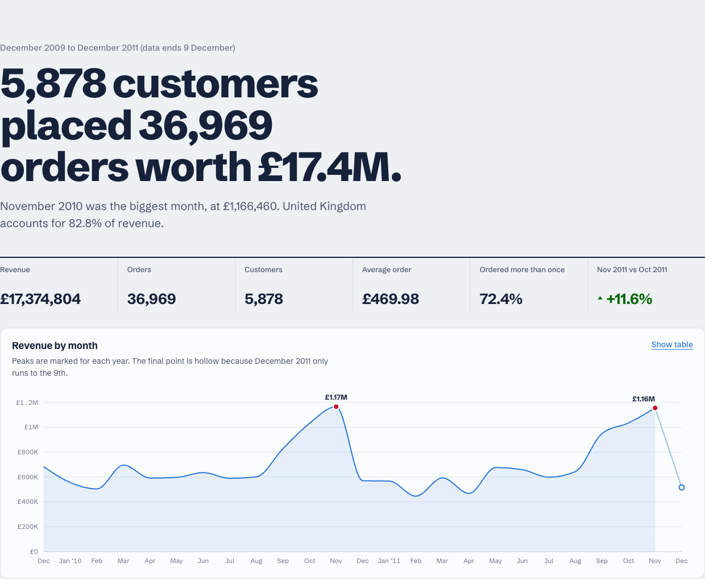
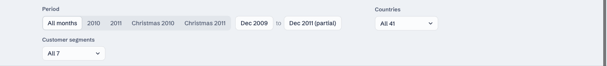
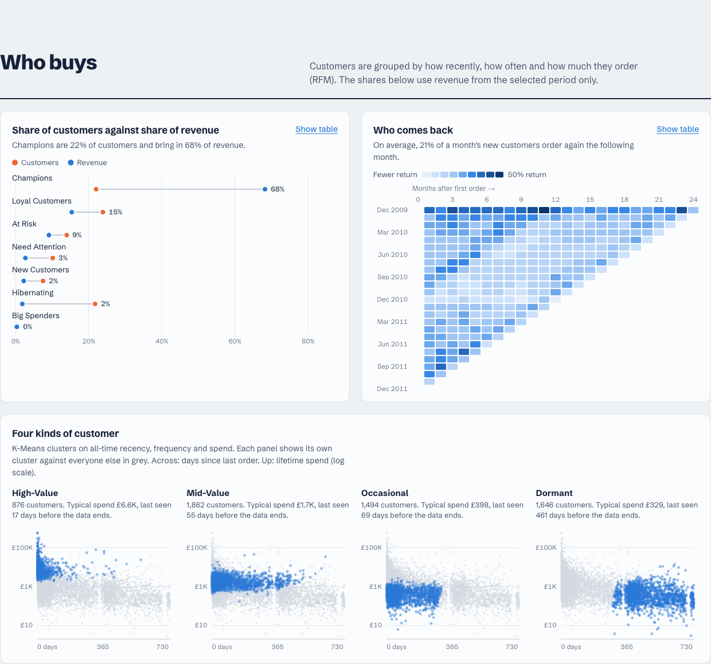
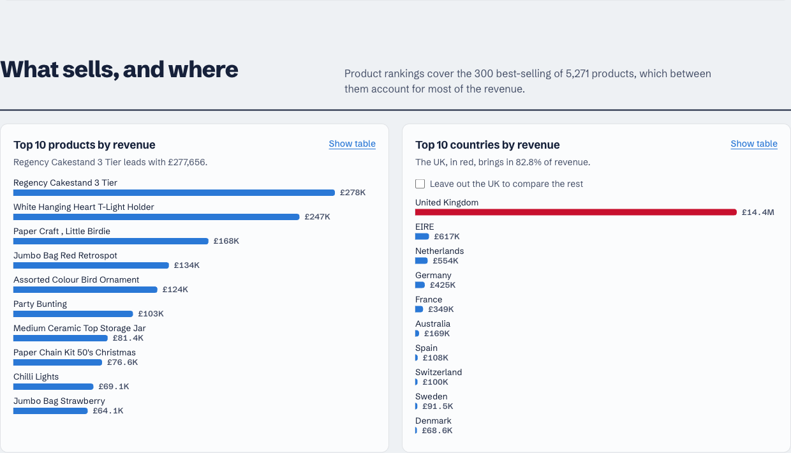
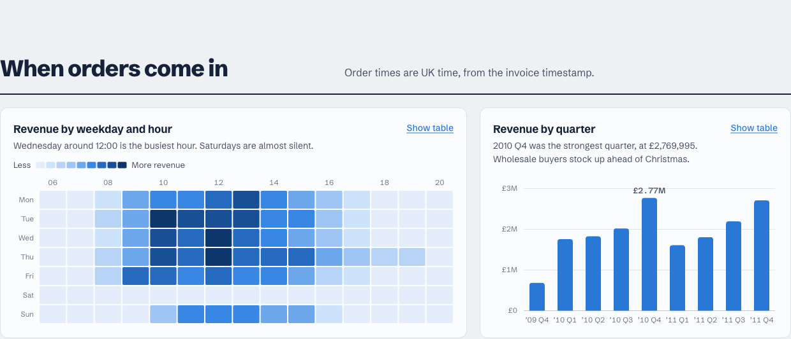
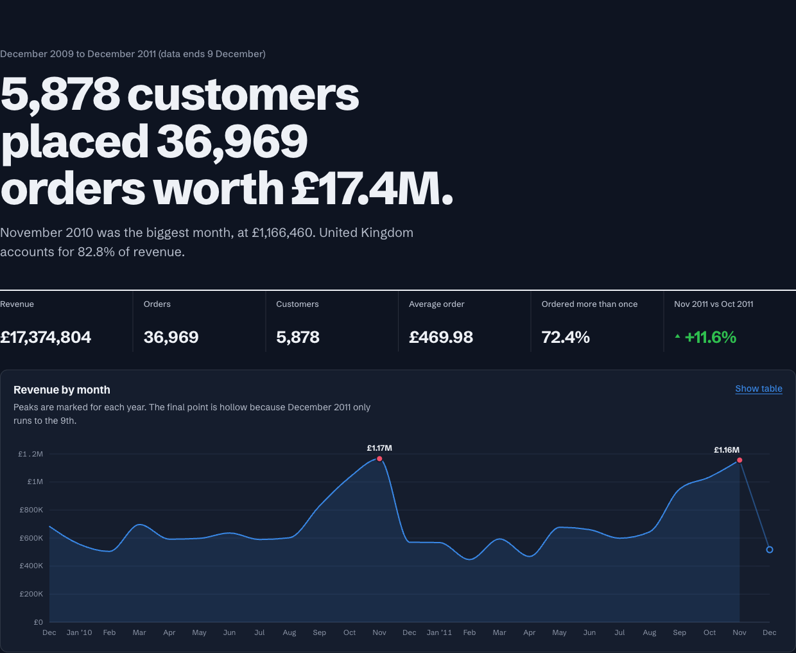
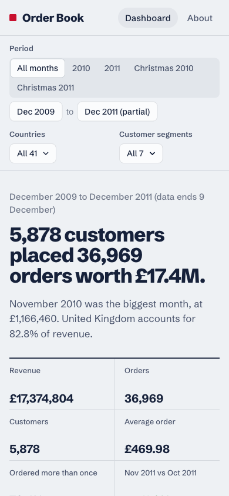
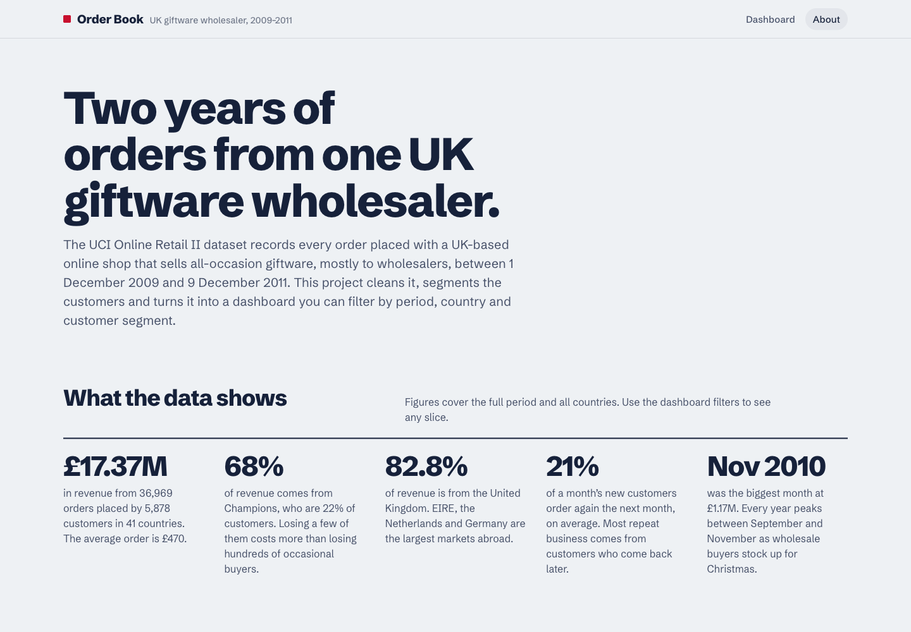

# E-Commerce Sales Intelligence Dashboard

An end-to-end analytics project analysing 779K+ cleaned retail transaction lines (36,969 orders) across 41 countries, featuring interactive visualisations, customer segmentation, and strategic business insights.

**Live dashboard:** https://ecommerce-dashboard-umber-five.vercel.app


[](https://ecommerce-dashboard-umber-five.vercel.app)

## Overview

This project transforms raw transactional data from the [UCI Online Retail II](https://archive.ics.uci.edu/ml/datasets/Online+Retail+II) dataset into actionable business intelligence through:

- **Web Dashboard (Next.js)** — Fast, filterable dashboard deployed on Vercel; every chart recomputes in the browser for any period, country and customer segment
- **Streamlit Dashboard** — The original Python dashboard with the same cross-filters
- **RFM Customer Segmentation** — Recency, Frequency, Monetary scoring to classify 5,878 customers into 7 behavioral segments
- **K-Means Clustering** — Unsupervised learning to discover 4 natural customer groups with CLV estimation
- **16 Publication-Quality Visualizations** — Monthly trends, cohort retention, geographic analysis, and more

## Tech Stack

| Component | Technology |
|-----------|-----------|
| Language | Python 3.9+ |
| Data Processing | Pandas, NumPy |
| Visualization | Matplotlib, Seaborn |
| Machine Learning | scikit-learn (K-Means, StandardScaler) |
| Dashboard | Streamlit |
| Web frontend | Next.js 16, React 19, TypeScript, d3-scale/d3-shape (hand-built SVG charts) |
| Hosting | Vercel (web), Streamlit Cloud (Python app) |
| Dataset | UCI Online Retail II (1.07M raw lines, 779K after cleaning) |

## Project Structure

```
├── app.py                          # Streamlit dashboard
├── pages/1_About.py                # Streamlit About page
├── web/                            # Next.js frontend (deployed to Vercel)
│   ├── public/data/dashboard.json  # Compact invoice-level export (~460 KB gzipped)
│   └── src/                        # App Router pages, charts, aggregation logic
├── scripts/
│   ├── data_cleaning.py            # Phase 2: Data cleaning & feature engineering
│   ├── kpi_analysis.py             # Phase 3: KPI analysis & 12 visualizations
│   ├── advanced_analytics.py       # Phase 4: K-Means clustering & CLV estimation
│   ├── extract_kpis.py             # KPI extraction utility
│   └── export_web_data.py          # Builds web/public/data/dashboard.json
├── outputs/
│   ├── figures/                    # 16 saved chart images
│   └── reports/
│       ├── executive_summary.md    # 1-page executive summary
│       ├── strategic_recommendations.md
│       ├── dashboard_guide.md
│       └── resume_bullets.md
├── data/
│   ├── raw/                        # Original Excel file (not tracked)
│   └── cleaned/                    # Processed CSVs (tracked, used by both dashboards)
├── docs/screenshots/               # README screenshots of the web dashboard
├── requirements.txt
├── TODO.md
└── README.md
```

## Key Findings

- **Revenue**: £17.37M across 36,969 orders from 5,878 customers (average order £470)
- **Customer Concentration**: 22% of customers (Champions) drive ~68% of revenue
- **Geographic Risk**: 82.8% of revenue from the UK alone
- **Retention**: only ~21% of a month's new customers order again the next month (~79% Month-1 churn)
- **Repeat Buying**: 72.4% of customers order more than once over the two years
- **Seasonality**: Q4 generates peak revenue; November 2010 (£1.17M) is the biggest month

## Web Dashboard (Next.js)

Live at **https://ecommerce-dashboard-umber-five.vercel.app**

- Headline sentence and 6 KPIs that rewrite themselves for the active filters
- Monthly revenue trend with yearly peaks marked (partial December 2011 shown hollow)
- RFM segments: share of customers vs share of revenue
- Cohort retention heatmap and K-Means cluster small multiples
- Top products (merchandise only) and top countries (with a "leave out the UK" toggle)
- Weekday × hour revenue heatmap and quarterly revenue
- Every chart has hover/keyboard tooltips and a "Show table" view; light and dark mode; responsive to phone width

### Screenshots

**Filters** — period presets or a custom month range, country and customer-segment pickers. Every number on the page follows them.



**Who buys** — RFM segments (share of customers vs share of revenue), cohort retention, and the four K-Means clusters.



**What sells, and where** — top products (merchandise only) and top countries, with the UK highlighted.



**When orders come in** — revenue by weekday and hour, and by quarter.



<table>
  <tr>
    <td width="72%"><strong>Dark mode</strong><br></td>
    <td width="28%"><strong>Mobile</strong><br></td>
  </tr>
</table>

**About page** — findings, method and known limits.



```bash
# Rebuild the data export after changing the pipeline
python scripts/export_web_data.py

cd web
npm install
npm run dev        # http://localhost:3000
npm run build
```

Deploy: pushes to `main` auto-deploy via the connected Vercel project `ecommerce-dashboard` (Root Directory `web`); manual deploy with `cd web && vercel deploy --prod`.

## Streamlit Dashboard

The interactive Streamlit dashboard includes:

- **6 KPI Cards** — Total Revenue, Orders, Customers, AOV, MoM Growth, Repeat Rate
- **8 Dynamic Charts** — Monthly/Quarterly revenue, RFM donut, segment revenue, top products, top countries, hourly & daily patterns
- **3 Cross-Filters** — Date range, Country, Customer Segment (all three apply to every KPI and chart)
- **Real-Time Updates** — All charts react to filter changes

## How to Run

### Prerequisites
Download the dataset from [UCI Machine Learning Repository](https://archive.ics.uci.edu/ml/datasets/Online+Retail+II) and place the Excel file in `data/raw/`.

### Setup
```bash
pip install -r requirements.txt
```

### Run the Pipeline
```bash
# Step 1: Clean raw data
python scripts/data_cleaning.py

# Step 2: Generate KPI analysis & charts
python scripts/kpi_analysis.py

# Step 3: Run advanced analytics (K-Means, CLV)
python scripts/advanced_analytics.py
```

### Launch Dashboard
```bash
streamlit run app.py
```

## Methodology

### RFM Segmentation
Each customer scored on **Recency** (days since last purchase), **Frequency** (order count), and **Monetary** (total spend) using quintile-based scoring (1–5), then mapped to 7 segments: Champions, Loyal Customers, Big Spenders, New Customers, Need Attention, At Risk, Hibernating.

### K-Means Clustering
Applied log-transformation and StandardScaler normalization to RFM features, then used the Elbow Method to determine optimal k=4 clusters. Resulting segments: High-Value, Mid-Value, Occasional, and Dormant customers.

### Customer Lifetime Value
Estimated using: `CLV = AOV × Monthly Purchase Frequency × Average Customer Lifespan`, where monthly frequency is total orders ÷ total active customer-months (≈ £3.3K per customer).

## Known Limitations

- December 2011 only runs to the 9th; it is treated as a partial month and excluded from month-on-month growth.
- Cleaning drops cancellation lines but keeps the original orders they reversed, so two large, immediately cancelled orders (~£245K) remain in revenue. Fixing this needs the raw Excel file.
- Postage, manual adjustments and fees (~£306K) count in revenue but are excluded from product rankings in the web dashboard.
- RFM scores and clusters use each customer's full history, whatever period is filtered.

## License

This project uses the [UCI Online Retail II](https://archive.ics.uci.edu/ml/datasets/Online+Retail+II) dataset, which is publicly available for research and educational purposes.
